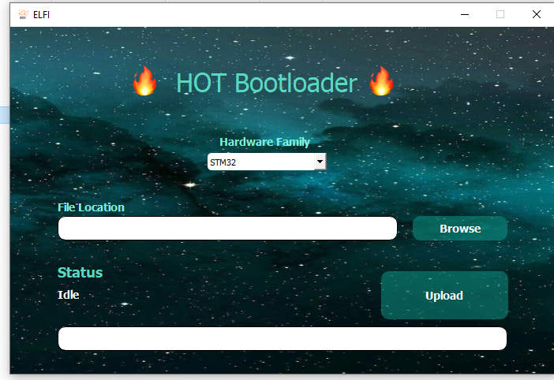

**Description:**

**First we will start by how we can install Pyside2 to make our GUI:**

Pyside2 is newer than PyQt and supports Python **v3.8.1** so:

1.  First make sure that the version of python you have is 3.8.1 by open CMD and
    write :

**\>\>python –version**

1.  After checking the python version start download Pyside2 using CMD window
    and run this command:

-   **\>\>pip install PySide2**

-   This command will install PySide2 site-packages in the following path

-   **C:\\Program Files\\Python38\\Lib\\site-packages\\PySide2\\**

-   Also will install the PySide2 GUI converter in the following Path

-   **C:\\Program Files\\Python38\\Scripts\\PySide2-uic.exe**

-   Then in the PySide site-package folder you will find designer tool called

-   **designer.exe**

-   Then create shortcut from **designer.exe** of designer app by making **right
    click** the choose **send to -\>desktop**

**Now we have PySide2 designer ……………………………………………………………………………………........**

**Second we will show how we can make our GUI step by step :**

1.  First open Pyside2 just click on **designer.exe,** this page will open

1.  Then choose Widget and press create button and this form will open

1.  Now we can make your design of GUI by choosing the components from This list

**Now we will see an example to make for example Hardware Family box in our
GUI**

-   First we will choose Combo Box from Component list

-   Then we will add it in our form as below

-   Then we need to add different types of ECU

-   Then if you need for example to change many options related to Combo Box

1.  **For example name of Qwidget from object Inspector part**

2.  **Changing Qwidget options from property part**

3.  **By adding signal to connect ComboBox with any another component using
    signal/slot editor**

-   Then to show result in GUI mode use **ctrl+R**

**So in our GUI we used many components as:**

-   **Combo Box**

-   **Label**

-   **Line Edit**

-   **Push Button**

-   **Text Browser**

1.  Then after finishing your GUI design save it in any location you need Then
    go to this location and open CMD and write

**\>\>pyside2-uic File.ui –o File.py**

>   This command used to generate output Python file from File.ui generated from
>   PySide2 designer

1.  Then open File.py and Write Your Logic that you needed to serve your
    application

-   ………………………………………………………………………………………………………………………………….

**Third we will discuss our Extra logic added to our GUI to serve our
Application (Firmware over the air) :**

-   It is the user interface to our project just open **Elfi.exe** and it will
    direct you to the GUI,

-   But first must read the **readme.txt** file in this location and make the
    necessary downloads

-   After finishing the installation open Elfi.exe and Browse the **Elf file as
    (Main_APP.elf)** needed to flash it on the target

-   Then press upload, and our GUI will call first the **CommReceive.c** to add
    all commands needed to flash in Text file (**tst.txt**)

-   Then GUI Python Script will call the **FirebaseTrial.py** to start
    Connection with FireBase and this done in parallel Thread with another
    Thread to update progressbar by the new values added by **FirebaseTrial.py**
    in **Progress.txt** file and this indicate how many number of frames have
    been sent and flashed on our target and also updating the Title from setup
    to n progress to the End according to the number of frames have been flashed

-   Then after finishing the process GUI will noticed you that the flashing done
    .

>   C:\\Users\\DELL\\Pictures\\Screenshots\\Screenshot (476).png

\\…………………………………………………………………………………………………………………………………………………/
